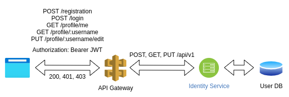
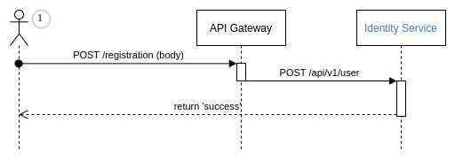
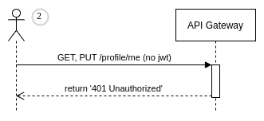
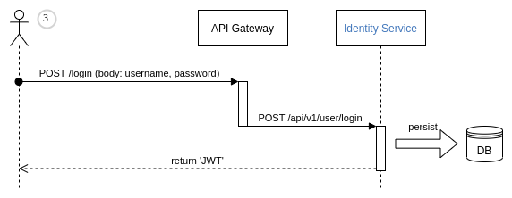
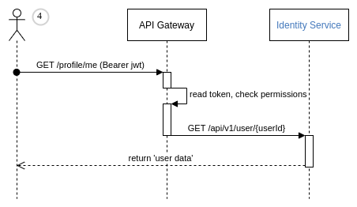
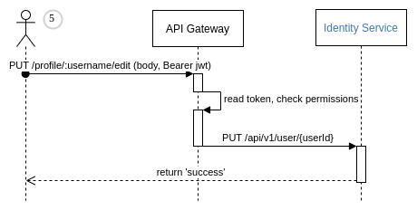
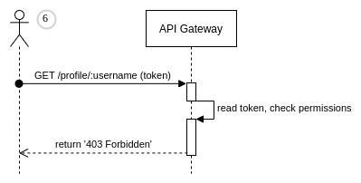

#### Домашнее задание "Backend for frontends. Api Gateway"

Реализовать сценарий "Изменение и просмотр данных в профиле клиента".

Пользователь регистрируется. Заходит под собой и по-определенному url получает данные о своем профиле. Может поменять данные в профиле. Данные профиля для чтения и редактирования не должны быть доступны другим клиентам (аутентифицированным или нет).

На выходе должны быть:

0) описание архитектурного решения и схема взаимодействия сервисов (в виде картинки)
1) команда установки приложения (из helm-а или из манифестов). Обязательно указать в каком namespace нужно устанавливать, команда установки api-gateway, если он отличен от nginx-ingress.
2) тесты postman, которые прогоняют сценарий:
    - регистрация пользователя №1
    - проверка, что изменение и получение профиля пользователя недоступно без логина
    - вход пользователя №1
    - изменение профиля пользователя №1
    - проверка, что профиль поменялся
    - выход* (если есть)
    - регистрация пользователя №2
    - вход пользователя №2
    - проверка, что пользователь №2 не имеет доступа на чтение и редактирование профиля пользователя1.

В тестах обязательно:
- наличие {{baseUrl}}
- использование домена arch.homework в качестве initial значения {{baseUrl}}
- использование сгенерированных случайно данных в сценарии
- отображение данных запроса и данных ответа при запуске из командной строки с помощью newman.


Подготовка к развертыванию в kubernetes
```batch
mvn clean install package

docker-compose -f identity/target/docker-compose.yml build
docker-compose -f api-gateway/target/docker-compose.yml build

docker login -u symryvvin
docker push symryvvin/api-gateway:1.0
docker push symryvvin/identity:1.0
```

##### Архитектурное решение

Примечание: приложение работает без базы данных, чтобы упростить запуск развертывание, в связи с этим identity разворачивается с параметром  __spec.replicas: 1__, т.к. используется InMemory хранилище в качестве HashMap



1. Регистрация пользователя
   
   
2. Запрос профиля без ключа
   
   
3. Логин
   
   
4. Профиль текущего пользователя
   
   
5. Изменение данных пользователя
   
   
6. Профиль другого пользователя
   
   


##### Проверка ДЗ

```batch
kubectl create namespace otus

kubectl apply -f homework/deploy-identity/  -n otus
kubectl apply -f homework/deploy-gw/  -n otus

newman run homework/api-gateway-hw.postman_collection.json
```
